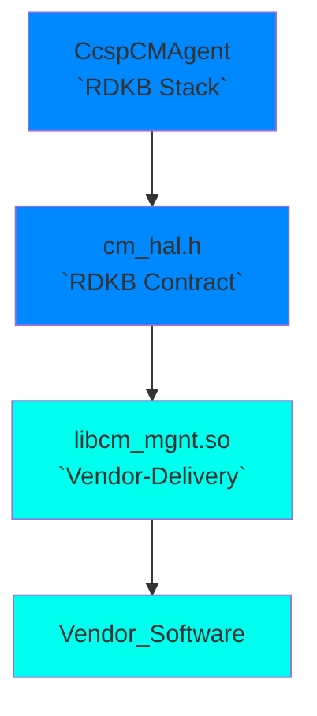
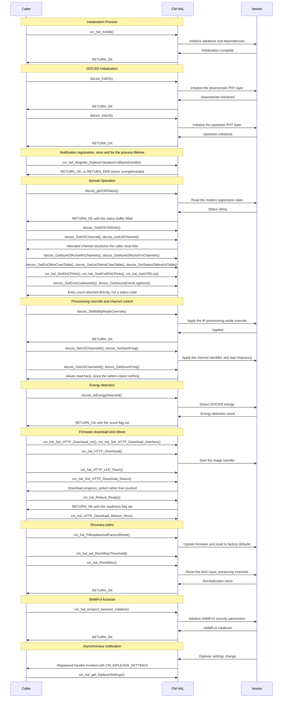
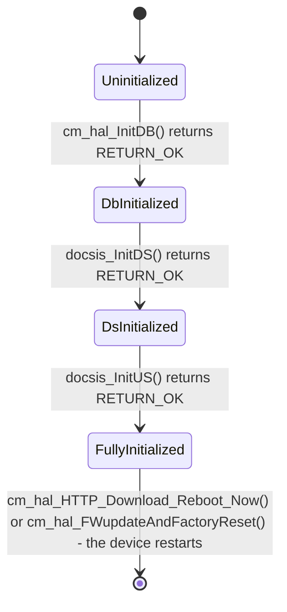
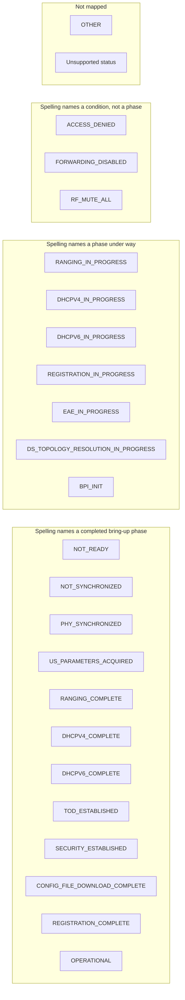

# CM HAL Documentation

## Version History

This table records revisions of *this document*. It is not the version of the interface, of the repository, or of the generated documentation site; those are three further identities, kept apart immediately below.

| Date | Comment | Version |
| --- | --- | --- |
| 2026-08-24 | First recorded revision of this document. Brought to the canonical `HAL` specification topic set: every declared `API` is named, the four version identities are separated, the asynchronous-notification and device-management claims are corrected against `include/cm_hal.h`, and the placeholder identifiers in the sequence diagram are replaced with declared ones. | 0.1.0 |

**Provenance of this page.** It was renamed from `docs/pages/CMhalSpec.md` to the canonical `docs/pages/` specification page in the same change that rewrote it against the canonical topic set. Git records a rename only where the two versions still resemble each other, and a full rewrite does not, so a `--follow` listing of the canonical path begins at that change, and the revisions before it are reached by listing the legacy path instead:

```sh
git log --follow -- docs/pages/halSpec.md
git log --follow -M1% -- docs/pages/halSpec.md
git log -- docs/pages/CMhalSpec.md
```

That resemblance is measured, and the threshold is 50% by default, so lowering it to git's floor with the second command above is worth trying first: where it pairs the two paths it shows both stretches of history in one listing, and where the rewrite kept too little of the original for git to pair them at any threshold the third command remains the only route to the earlier revisions.

Four version identities exist around this interface, and a reader who conflates them will draw the wrong conclusion about how mature it is:

- **Document revision** \- the `Version` column above. No revision of this document was recorded before this one, so the table begins here rather than claiming a history it cannot show.
- **Release tag** \- `1.0.1`, the nearest ancestor tag of the revision this document describes. The repository's changelog records `1.0.1` without a date, carrying a header syntax fix, and `1.0.0` on 2024-06-07, which migrated the `CM HAL` header into this repository. A later tag `1.1.0` exists in the repository, but it is not an ancestor of this revision and is absent from that changelog, so no later release is claimed here.
- **Interface version** \- **none is published.** `include/cm_hal.h` declares no version macro; its complete macro set is tabulated under `Data Structures and Defines` and holds type aliases, status codes and bounds only. A caller therefore cannot test which revision of the interface it compiled against, and `Variability Management` states what governs the interface's evolution instead.
- **Generated-site version string** \- `docs/generate_docs.sh` derives `PROJECT_VERSION` from `git describe --tags`, which yields a string of the form `<tag>-<commits-since-tag>-g<abbreviated-hash>`. It is a build identifier, not a released version, and must not be read as one. Its value is computed when the documentation is generated and changes with every commit, including the commit that would record it, so no literal value is reproduced here: a reader who needs the string for the revision in front of them runs `git describe --tags` against that revision.

## Acronyms

The expansions below cover the terms this document uses. Interface terminology follows `include/cm_hal.h`.

- `ANSC` \- the legacy `RDK` type prefix carried by the `ANSC_IPV4_ADDRESS` macro; this interface does not expand it
- `API` \- Application Programming Interface
- `BPI` \- Baseline Privacy Interface, the `DOCSIS` link-layer security protocol
- `CM` \- Cable Modem
- `CM HAL` \- Cable Modem Hardware Abstraction Layer, the interface this document specifies
- `CMTS` \- Cable Modem Termination System, the head-end a modem registers with
- `CPE` \- Customer Premises Equipment
- `DHCP` \- Dynamic Host Configuration Protocol
- `DOCSIS` \- Data Over Cable Service Interface Specification
- `DS` \- Downstream, the direction from the network toward the modem
- `DSOFDM` \- Downstream Orthogonal Frequency Division Multiplexing
- `HAL` \- Hardware Abstraction Layer
- `HTTP` \- Hypertext Transfer Protocol
- `IP` \- Internet Protocol
- `IPv4` \- Internet Protocol version 4
- `IPv6` \- Internet Protocol version 6
- `LED` \- Light Emitting Diode, the indicator the download path flashes
- `LLD` \- Low Latency DOCSIS
- `MAC` \- Media Access Control
- `MDD` \- MAC Domain Descriptor
- `OFDM` \- Orthogonal Frequency Division Multiplexing
- `OFDMA` \- Orthogonal Frequency Division Multiple Access
- `PHY` \- Physical layer
- `QoS` \- Quality of Service
- `RDK-B` \- Reference Design Kit for Broadband
- `SLA` \- Service Level Agreement
- `SNMP` \- Simple Network Management Protocol
- `SNR` \- Signal-to-Noise Ratio
- `TFTP` \- Trivial File Transfer Protocol
- `ToD` \- Time of Day
- `URL` \- Uniform Resource Locator
- `US` \- Upstream, the direction from the modem toward the network
- `USOFDMA` \- Upstream Orthogonal Frequency Division Multiple Access
- `WAN` \- Wide Area Network

## Description

The `CM HAL` abstracts a `DOCSIS` cable modem - the `CM` in every identifier below - so that `RDK-B` can drive it without depending on the modem chipset or on which `DOCSIS` generation it implements. This repository holds the interface definition only: a vendor supplies the implementation behind it, and the caller is the `RDK-B` middleware. The workspace inventory names `CcspCMAgent` as the service that consumes this interface through `cm_hal.h`, so a tool or test that drives the `HAL` directly contends with that service for the modem; on the reference platforms the services to stop first are `checkbrcmwifisupport` and `CcspPandMSsp`.

The diagram below describes a high-level software architecture of the Broadband CM HAL module stack.



Every diagram in this document is fenced Mermaid. It renders as a diagram on GitHub, which is the surface a developer reads through this repository's README symlink; in the documentation site the generator produces, the same block appears as diagram source rather than as a picture.

**What this interface declares**, taken from the 51 function prototypes and the callback typedef in `include/cm_hal.h`:

- **Initialization.** `cm_hal_InitDB()` brings up the `HAL` and its dependencies; `docsis_InitDS()` and `docsis_InitUS()` prepare the downstream and upstream `PHY` layers and direct hardware access. **No de-initialization function is declared** - see `Object Lifecycles`.
- **Status and registration.** The modem's `DOCSIS` status as a formatted string, and the registration detail behind it: scanning, ranging, `TFTP` config-file download, data registration, `ToD` synchronisation, `BPI` state and network access.
- **Channel information and statistics.** Downstream and upstream channel parameters, active channel counts, error codeword counts, and the `DOCSIS 3.1` `DSOFDM` and `USOFDMA` channel and status tables.
- **Channel and frequency control.** The upstream channel identifier, the primary downstream start frequency and the `MDD` `IP` provisioning-mode override. With the `HTTP` download settings and the `MAC` re-initialisation threshold, these are the only values this interface lets a caller write.
- **Addressing information, read-only.** `DHCP` and `IPv6` `DHCP` information and the `CPE` list are retrieved, never set. **This interface declares no setter for an `IP` address, a subnet mask or a default gateway**; a caller that must change addressing does so outside this interface.
- **Firmware download and recovery.** `HTTP` download configuration, initiation and status polling, `LED` flashing during a download, reboot readiness, reboot, firmware update with factory reset, and `MAC`-layer re-initialisation with its threshold.
- **Diagnostics and identity.** The `DOCSIS` event log, certificate file path and status, four reset counters, market region, `SNMP` v3 kickstart initialisation and `DOCSIS` energy detection.
- **Asynchronous notification.** One callback, for diplexer variation - see `Asynchronous Notification Model`.

The interface is layered rather than monolithic: a caller may stay at the level of "is the modem online" through `docsis_getCMStatus()`, or descend to per-channel `DOCSIS 3.1` statistics, without changing how it links against the `HAL`. `API Surface` is the complete index of what is available at either level.

## Optional Components

The following components are optional and it is up to the vendor's discretion whether a platform provides them. Where a facility is absent the declaration that reaches it still exists, because it is part of the interface; what varies is whether the implementation behind it does anything. `include/cm_hal.h` is the only source for this topic - each entry below quotes what that header states, and nothing is inferred from a function's name.

- **Diplexer configuration and its notification.** `cm_hal_get_DiplexerSettings()` reads the current upstream and downstream diplexer band edges, and `cm_hal_Register_DiplexerVariationCallback()` installs the handler that follows their changes. The registration function's documented `RETURN_ERR` covers the case "if not supported/implemented, or in case of errors (e.g., stub function, misconfiguration)", so a vendor may legitimately ship it as a stub. A caller must therefore treat a failed registration as "this platform does not report diplexer variation" and continue, not as an error worth retrying.
- **Low Latency DOCSIS.** `docsis_LLDgetEnableStatus()` returns `DISABLE` both when `LLD` is disabled and when the entry is missing from the modem's bootfile, which the header states explicitly. Absence of the feature and absence of its provisioning are consequently not distinguishable through this interface.
- `DOCSIS 3.1` **channel tables.** `docsis_GetDsOfdmChanTable()`, `docsis_GetUsOfdmaChanTable()` and `docsis_GetStatusOfdmaUsTable()` describe `DOCSIS 3.1` `OFDM` and `OFDMA` channels; a modem operating on an earlier `DOCSIS` generation has none to report. The header defines no distinct return code for that case, so a caller reads the entry count these functions write and treats zero entries as "none present" rather than inferring a failure.

No other facility in this interface is marked optional by `include/cm_hal.h`. In particular the header does not establish whether `cm_hal_GetMarket()`, `cm_hal_snmpv3_kickstart_initialize()` or the four reset counters are implemented on every platform, so a caller must not read a declaration's presence in the header as a guarantee that the platform behind it supports the operation.

## Component Runtime Execution Requirements

This interface is delivered as a shared library the caller links against, and its lifetime is the lifetime of the calling process. The requirements in this block are the ones a caller can rely on and a vendor implementation must meet; each states the source it is taken from, which is either `include/cm_hal.h` or this specification's own statement of policy for the `CM HAL`.

### Initialization and Startup

During initialization and startup, the Broadband CM client module is required to invoke the following APIs in sequence:

- `cm_hal_InitDB()` - initializes the `HAL` and its dependencies. Its documented failure cases are the failure to create threads or to open files.
- `docsis_InitDS()` - prepares the global `PHY`-level data structures and direct hardware access for the downstream (`DS`) direction.
- `docsis_InitUS()` - the same for the upstream (`US`) direction.

`cm_hal_InitDB()` is expected to block if the hardware is not ready. It is the one exception to the non-blocking requirement stated under `Blocking calls`, and it is the reason a caller should perform initialization on a thread whose progress nothing else depends on.

Initialization is mandatory before any other operation: the `HAL` must be initialized before a caller reads status, configures channels or registers a notification handler. Nothing in `include/cm_hal.h` returns a distinct code for "not initialized", so a caller must not attempt to detect the condition from a return value - it must enforce the order itself.

### Threading Model

The interface is not required to be thread safe.

Vendors can implement internal threading and event mechanisms for operational purposes. These mechanisms must ensure thread safety when interacting with the provided interface. Additionally, they must guarantee cleanup of resources upon closure.

The consequence for a caller is concrete: two threads must not call into this interface concurrently unless the caller serialises them itself. **This interface does not specify which thread the diplexer variation callback is invoked on**, and neither the typedef at `cm_hal.h:3569` nor its registration function at `cm_hal.h:3638` states it, so a handler must serialise its own access to caller state rather than assume it runs on the registering thread.

### Process Model

This module is expected to be called from multiple process.

The requirement is to ensure that the module can handle concurrent calls effectively. The vendor needs to implement proper synchronization and scalability measures for robust performance.

`include/cm_hal.h` states no process affinity on any declaration, so the requirement above is this specification's rather than the header's, and it is left to the implementation how the synchronization is achieved.

### Memory Model

#### Caller Responsibilities

- Callers must assume full responsibility for managing any memory explicitly given to the module functions to populate. This includes proper allocation and de-allocation to prevent memory leaks.
- All strings used in this module must be zero-terminated. This ensures that string functions can accurately determine the length of the string and prevents buffer overflows when manipulating strings.
- Where the interface fixes a minimum buffer size, `include/cm_hal.h` states it on the declaration and the caller must honour it. The three the header names are the status buffer of `docsis_getCMStatus()`, at least 40 bytes; the `HTTP` `URL` and filename buffers of `cm_hal_Set_HTTP_Download_Url()` and `cm_hal_Get_HTTP_Download_Url()`, at least 200 bytes each, where the header warns that an insufficient buffer can lead to memory corruption; and the mode string of `cm_hal_GetCPEList()`, at most 100 bytes.
- Five functions invert the usual direction and hand back memory the **caller** must release: `docsis_GetDSChannel()` and `docsis_GetUSChannel()` return a dynamically allocated structure, and `docsis_GetDsOfdmChanTable()`, `docsis_GetUsOfdmaChanTable()` and `docsis_GetStatusOfdmaUsTable()` return a dynamically allocated array whose length they report through their entry-count argument. Failing to free these is a leak in the caller, not in the `HAL`.

#### Module Responsibilities

- Modules must allocate and de-allocate memory for their internal operations, ensuring efficient resource management.
- Modules are required to release all internally allocated memory upon closure to prevent resource leaks.
- All module implementations and caller code must strictly adhere to these memory management requirements for optimal performance and system stability. Unless otherwise stated specifically in the API documentation.

That final escape clause is not decorative: it is what the five caller-frees functions above rely on, and it is why a caller reads each declaration's own documentation in `include/cm_hal.h` before assuming who owns a buffer. Where the header says the caller must provide a pre-allocated structure - as it does for `docsis_GetDOCSISInfo()`, `docsis_GetErrorCodewords()`, `cm_hal_GetDHCPInfo()` and `cm_hal_GetIPv6DHCPInfo()` - the module allocates nothing on the caller's behalf.

### Power Management Requirements

`include/cm_hal.h` declares no power-management entry point, and no declaration or comment in it states an obligation on the implementation when the device changes power state. **This interface therefore specifies no participation in power management.** A caller must not assume that the `HAL` is notified of a power-state transition, and must not treat any function here as a way to request one; the functions that come closest are recovery operations rather than power controls - `cm_hal_HTTP_Download_Reboot_Now()` reboots the device and `cm_hal_FWupdateAndFactoryReset()` updates firmware and resets to factory defaults, both described under `API Surface`.

### Asynchronous Notification Model

This interface declares exactly one asynchronous notification, and it is the diplexer variation callback. `cm_hal_DiplexerVariationCallback` (`cm_hal.h:3569`) is documented as the "type of the handler the CM HAL invokes when the diplexer settings change" (`cm_hal.h:3527`), which "the implementation invokes ... when the modem's diplexer band edges change" (`cm_hal.h:3530-3531`), and it is installed by `cm_hal_Register_DiplexerVariationCallback()` (`cm_hal.h:3638`).

Four properties of it bind a caller, all stated by the header:

- **Registration is one-way.** "The registered callback cannot be removed and should be provided during initialization." There is no unregister function, so a caller installs the handler once, during startup, and the handler must remain valid for the lifetime of the process.
- **The handler receives the settings by value.** It is passed a `CM_DIPLEXER_SETTINGS` structure holding the upstream and downstream diplexer upper band edges in `MHz`, so there is no lifetime question about the data itself.
- **The handler returns a status.** `RETURN_OK` on successful processing of the settings, `RETURN_ERR` on error - for example a failure to handle the settings change.
- **Registration may legitimately fail.** `RETURN_ERR` covers "not supported/implemented", including a stub implementation, which is why `Optional Components` treats the whole diplexer facility as optional.

Because `Threading Model` does not establish which thread invokes the handler, and because `Blocking calls` requires the interface's callers not to suspend the calling context, a handler should do the least work necessary - record the new settings and return - and leave any lengthy reaction to the caller's own thread.

No other notification exists here: nothing in `include/cm_hal.h` registers an event handler for registration state, channel changes or firmware download progress. Download progress in particular is polled, through `cm_hal_Get_HTTP_Download_Status()`, not pushed.

### Blocking calls

The APIs are expected to work synchronously and should complete within a time period commensurate with the complexity of the operation and in accordance with any relevant Broadband CM specification. Any calls that can fail due to the lack of a response from connected device should have a timeout period in accordance with any API documentation.
This API is called from a single thread context, therefore it must not suspend.

Two departures from that rule are stated by the interface itself and are the ones a caller must plan around:

- `cm_hal_InitDB()` is expected to block if the hardware is not ready, as `Initialization and Startup` records.
- `docsis_ClearDocsisEventLog()` carries the opposite obligation in the other direction: the header states that the function "must not block or use blocking system calls", and describes the clearing as asynchronous, likely by sending a message to a driver event handler. A caller therefore has no completion signal for it beyond its return code.

**No numeric timeout is specified by this interface.** `include/cm_hal.h` states no per-function time bound, and neither does this specification; a caller that needs a bound must impose it, and a vendor implementation must not rely on an unbounded wait. The long-running operations are the ones to watch: `cm_hal_HTTP_Download()` initiates a download whose progress is read separately through `cm_hal_Get_HTTP_Download_Status()`, which is the interface's own answer to "do not block for the duration of a firmware transfer".

### Internal Error Handling

**Synchronous Error Handling:** All Broadband CM HAL APIs must return errors synchronously as a return value. This ensures immediate notification of errors to the caller.

**Internal Error Reporting:** The HAL is responsible for reporting any internal system errors (e.g., out-of-memory conditions) through the return value.

**Focus on Logging for Errors:** For system errors, the HAL should prioritize logging the error details for further investigation and resolution. Recovery attempts at the interface level are not expected to be successful in these cases.

**The vocabulary is deliberately narrow, and a caller must read the return type before reading the return value.** `include/cm_hal.h` defines `RETURN_OK` as `0` and `RETURN_ERR` as `-1`, and most declarations here report only those two, so a caller learns that an operation failed but not why. Three shapes exist and they are not interchangeable:

| Return shape | Declarations | What a caller does with it |
| --- | --- | --- |
| A status code | 45 of the 51 declarations, plus the callback | Compare against `RETURN_OK` and `RETURN_ERR`. The reason for a failure is not reported; the header's own per-function text names the usual causes - null pointers, allocation failure, retrieval error - but the code does not distinguish them. |
| A value, not a status | `docsis_GetUSChannelId()` returns the channel identifier, `docsis_GetDownFreq()` returns the frequency, `docsis_GetDocsisEventLogItems()` returns the number of log entries it retrieved, and `cm_hal_Get_HTTP_Download_Status()` returns a download progress or error value | There is no error code to test. `docsis_GetDocsisEventLogItems()` is the well-behaved case: a count of zero is a meaningful answer. `cm_hal_Get_HTTP_Download_Status()` is the one value return that names its own failures, in the `400` - `407` and `500` range documented at `cm_hal.h:2330-2354`, and `0` means "not started" rather than "succeeded". For the remaining two the interface defines no sentinel, so a caller cannot distinguish a failed read from a genuine value and should treat the surrounding state as its only evidence. |
| Nothing at all | `docsis_SetUSChannelId()` and `docsis_SetStartFreq()` are declared `void` | The write cannot be confirmed through the call. A caller that must know whether it took effect reads the value back with `docsis_GetUSChannelId()` or `docsis_GetDownFreq()`. |

`docsis_LLDgetEnableStatus()` is the one function returning a three-way result: `ENABLE`, `DISABLE` or `RETURN_ERR`. Because `DISABLE` also covers a missing bootfile entry, only `RETURN_ERR` indicates a failed read.

### Persistence Model

There is no requirement for the HAL to persist any setting information.

That statement bounds the `HAL`, not the modem. Two consequences follow, and neither is resolved by `include/cm_hal.h`: **the interface does not state whether a value written through it survives a reboot** - the upstream channel identifier, the primary downstream start frequency, the `MAC` re-initialisation threshold and the `HTTP` download settings are all written without any documented persistence guarantee - and the values it reads from the modem's own provisioning, such as the `LLD` bootfile entry read by `docsis_LLDgetEnableStatus()`, are persisted by the provisioning system rather than by this interface. A caller that needs a setting to be durable must re-apply it after a restart.

## Non functional requirements

Following non functional requirement should be supported by the component. Each topic below states whether what it requires comes from this specification's own policy or from `include/cm_hal.h`.

### Logging and debugging requirements

The component is required to record all errors and critical informative messages to aid in identifying, debugging, and understanding the functional flow of the system. Logging should be implemented using the syslog method, as it provides robust logging capabilities suited for system-level software. The use of `printf` is discouraged unless `syslog` is not available.

All HAL components must adhere to a consistent logging process. When logging is necessary, it should be performed into the `cm_vendor_hal.log` file, which is located in the `/rdklogs/logs/` directory.

Logs must be categorized according to the following log levels, as defined by the Linux standard logging system, listed here in descending order of severity:

- **FATAL**: Critical conditions, typically indicating system crashes or severe failures that require immediate attention.
- **ERROR**: Non-fatal error conditions that nonetheless significantly impede normal operation.
- **WARNING**: Potentially harmful situations that do not yet represent errors.
- **NOTICE**: Important but not error-level events.
- **INFO**: General informational messages that highlight system operations.
- **DEBUG**: Detailed information typically useful only when diagnosing problems.
- **TRACE**: Very fine-grained logging to trace the internal flow of the system.

Each log entry should include a timestamp, the log level, and a message describing the event or condition. This standard format will facilitate easier parsing and analysis of log files across different vendors and components.

Logging carries more weight in this interface than in one with a richer error vocabulary: as `Internal Error Handling` records, most declarations report only `RETURN_OK` or `RETURN_ERR`, so the vendor log is where the reason for a failure has to be found.

**Credentials and device identifiers must not be logged.** This interface moves both, so the requirements below are normative rather than advisory and they bind the vendor implementation and the RDK-B caller equally. They are stated here because the interface declares no redaction helper and no secure-buffer type, so nothing enforces them mechanically.

- **The protected values, named exactly.** The `SNMPv3` security name and security number carried in every row of the `snmpv3_kickstart_table_t` that `cm_hal_snmpv3_kickstart_initialize` receives are management-plane credentials \- they authenticate an operator to the modem, so a disclosed pair grants that access. The `MAC` addresses and lease detail that `cm_hal_GetDHCPInfo` reports, and the `CPE` `MAC` addresses in the tables the DOCSIS accessors return, are device identifiers that link a unit to a subscriber record and are personal data in that context.
- **None of them is written to a log at any severity**, placed in a diagnostic file or crash artefact, or included in an error message. The obligation is the caller's as much as the implementation's: a credential is just as exposed by the middleware that supplied it as by the `HAL` that consumed it.
- **Redact, do not truncate, where a value must be referenced.** A diagnostic that has to record which row of a kickstart table was rejected records the row index and substitutes a fixed redaction marker for the value. A prefix, a suffix or a length is not redaction \- a `MAC` prefix discloses the vendor, and a length alone distinguishes one credential format from another.
- **Clear after use.** A caller overwrites the buffers holding a security name or security number once the call has returned, rather than leave the material in reusable memory. `include/cm_hal.h` restates this obligation on the declaration itself.
- **A single failure code does not license logging the input.** Where one of these calls fails and `RETURN_ERR` is the only information available, the diagnostic records the operation and the outcome, never the credential or identifier that was passed.

### Memory and performance requirements

The component should not contributing more to memory and CPU utilization while performing normal Broadband CM operations and commensurate with the operation required.

**No memory footprint limit is specified for this interface.** Neither `include/cm_hal.h` nor this specification states a maximum resident size, a heap budget or a `CPU` share, so a vendor implementation is held to the proportionality requirement above rather than to a number. Where a caller needs a bound - on a memory-constrained platform, for instance - it must be agreed with the vendor outside this interface. The one memory obligation this interface does state precisely is ownership, under `Memory Model`.

### Quality Control

To maintain software quality, it is recommended that the CM HAL implementation is verified without any errors using third-party tools such as Coverity, Black Duck, Valgrind, etc.

Both HAL wrapper and 3rd party software implementations should prioritize robust memory management to guarantee leak-free and corruption-resistant operation.

**Keeping this document true:** every topic here names the file its content was derived from - `include/cm_hal.h` for an interface fact, the repository's changelog and its tags for `Version History`, `docs/generate_docs.sh` for the generated-site version string, the workspace README for the owning service and the platform inventory. Any change to one of those files obliges a review of the topics that cite it. That makes staleness detectable from a diff rather than from a review-by date, and in particular renaming, adding or removing a declared function invalidates `API Surface`, `Data Structures and Defines` and the `Sequence Diagram` immediately.

**Who reviews it:** `.github/CODEOWNERS` names `@rdkcentral/rdkb-hal-advisory` as the owner of every path in this repository, so that team is the addressee for the review obligation above and the reviewer of any pull request that changes this document.

### Licensing

Broadband CM HAL implementation is expected to released under the Apache License 2.0.

The full licence text is in `LICENSE`, with attribution in `NOTICE` and the copyright statement in `COPYING`; all three are linked into `docs/pages/` so the generated documentation carries them.

### Build Requirements

The source code should be capable of, but not be limited to, building under the Yocto distribution environment. The recipe should deliver a shared library named as `libcm_mgnt.so`.

A caller of that library:

1. must include `cm_hal.h` to make use of Broadband `CM HAL` capabilities;
2. must include a linker dependency for `libcm_mgnt`.

`libcm_mgnt.so` and the Yocto recipe are the only build artefacts this repository names; it declares no build manifest, no toolchain version and no compiler flag, so nothing further is stated here.

### Variability Management

The role of adjusting the interface, guided by versioning, rests solely within architecture requirements. Thereafter, vendors are obliged to align their implementation with a designated version of the interface. As per Service Level Agreement (`SLA`) terms, they may transition to newer versions based on demand needs.

Each API interface will be versioned using [Semantic Versioning 2.0.0](https://semver.org/spec/v2.0.0.html), the vendor code will comply with a specific version of the interface.

**That version is not readable from the header.** `include/cm_hal.h` publishes no version macro, so a caller cannot test at compile time or at runtime which revision of the interface it has, and must take the version from the release it consumed - see `Version History`, which separates the release tag from the three other identities it is often confused with.

### Platform or Product Customization

**This interface defines no compile-time customization flags.** The complete preprocessor surface of `include/cm_hal.h` is its include guard, the `extern "C"` guard, and the `#ifndef`-guarded macros tabulated under `Data Structures and Defines`; those guards exist so that a caller which already defines `CHAR`, `INT`, `RETURN_OK` and the rest keeps its own definitions, not to select a variant of the interface. Nothing here is conditionally declared, so there is no `CM HAL` equivalent of the build-variability flags other `RDK-B` HALs use, and no function or structure appears or disappears with a build option.

Product variation is instead expressed at runtime, and a caller reads it rather than compiling for it:

- `cm_hal_GetMarket()` reports the market region the modem is built for, for example `EURO` for Europe or `US` for the United States - a value whose spelling collides with the upstream abbreviation and means the country here.
- `docsis_GetDOCSISInfo()` reports the `DOCSIS` version the modem implements, which is what decides whether the `DOCSIS 3.1` tables under `Optional Components` have anything to return.
- `cm_hal_get_DiplexerSettings()` reports the diplexer band edges, which differ between regional plant designs.
- `docsis_LLDgetEnableStatus()` reports whether the modem's bootfile provisions Low Latency DOCSIS.

A caller that must behave differently per product should branch on those readings, because they are the only variability this interface exposes.

## Interface API Documentation

All `HAL` function prototypes and datatype definitions are available in the `cm_hal.h` file, grouped there as `CM_HAL_TYPES` for the data types and `CM_HAL_APIS` for the functions. The topics below describe how the interface is meant to be driven, index every declaration in it, and then show one complete exchange and the modem states a caller can observe. `Build Requirements` states what to include and link against.

### Theory of operation and key concepts

The three sub-topics below are derived from the declarations and comments in `include/cm_hal.h` together with the ordering this specification states under `Initialization and Startup`; where neither establishes something, that is said rather than filled in.

#### Object Lifecycles

- **Creation/Initialization:** The CM HAL interface is initialized using the `cm_hal_InitDB()` function. This function sets up the necessary database connections and initializes various subsystems required for further operations with the cable modem. The downstream and upstream `PHY` layers are then prepared by `docsis_InitDS()` and `docsis_InitUS()`.
- **Usage:** After initialization, the cable modem can be managed using various API functions that rely on the initialized state. These functions allow for configuring and querying modem parameters, managing downstream and upstream channels, handling events, and controlling operational states.
- **Destruction/Cleanup:** The CM HAL interface does not provide a specific function for system deinitialization. Applications are responsible for managing and freeing resources manually to prevent memory leaks - in particular the five allocations listed under `Caller Responsibilities` - and cleanup within the `HAL` is generally handled internally upon application termination. A caller cannot release and re-acquire the interface within one process, because there is nothing to release it with; the registered diplexer callback is bound by the same limitation, as `Asynchronous Notification Model` records.

#### Method Sequencing

- **Initialization is Mandatory:** The system must be initialized (`cm_hal_InitDB()`) before any other operations are performed. This ensures that all subsystems are properly configured.
- **Sequential Dependency:** While most functions can be called independently once initialization is complete, some operations logically depend on the state of the modem or previous API calls (e.g., configuring channels before retrieving channel-specific data).
- **Event Handling:** Functions such as `cm_hal_Register_DiplexerVariationCallback()` allow for dynamic event handling and should be set up early in the application lifecycle if needed, because the registration cannot be undone.
- **Write-then-read for the `void` setters:** `docsis_SetUSChannelId()` and `docsis_SetStartFreq()` report nothing, so a caller that needs confirmation reads the value back afterwards. `Internal Error Handling` gives the full return-shape breakdown.
- **Configure-then-start for a download:** the `HTTP` path is a sequence rather than a single call - set the `URL` and filename, optionally set the interface, initiate the download, then poll its status, and only then check reboot readiness and reboot.

#### State-Dependent Behavior

- **Implicit State Model:** The CM HAL interface operates under several implicit states:
  - **Uninitialized:** Before any initialization function has been called.
  - **Initialized:** The system has been initialized but may not yet be fully operational or connected to network services.
  - **Operational:** The modem is fully operational, and all functionality is available.
  - **Error states:** Various functions may return errors if the system is not in an appropriate state for the requested operation.
- **The modem's own state is observable but not controlled here.** `docsis_getCMStatus()` reports where the modem has reached in `DOCSIS` bring-up and `docsis_GetDOCSISInfo()` reports the same progress field by field; `State Diagram` tabulates both value sets and, because this interface states no transition model over them (`cm_hal.h:939-944`), draws no edges between them. A caller reads those values and polls for a change; the only sequence it can drive is the initialization order above, and the recovery operations - `cm_hal_ReinitMac()`, `cm_hal_HTTP_Download_Reboot_Now()` and `cm_hal_FWupdateAndFactoryReset()` - state no resulting modem status of their own.

### Data Structures and Defines

A caller of this interface constructs or interprets the types below. Every one is declared in `include/cm_hal.h` under the `CM_HAL_TYPES` group, and the field-level documentation is on the declaration itself; the tables here name each type, say where it is declared and what it represents, and leave the members to the header.

**Type aliases** \- `cm_hal.h:92` to `cm_hal.h:157`. Each is wrapped in `#ifndef`, so a caller that already defines the name keeps its own definition. They are what the function signatures in `API Surface` are written in.

| Alias | Underlying type |
| --- | --- |
| `CHAR` | `char` |
| `UCHAR` | `unsigned char` |
| `BOOLEAN` | `unsigned char` |
| `USHORT` | `unsigned short` |
| `UINT8` | `unsigned char` |
| `INT` | `int` |
| `UINT` | `unsigned int` |
| `LONG` | `long` |
| `ULONG` | `unsigned long` |

**Status and boolean constants** \- `cm_hal.h:162` to `cm_hal.h:202`. `Internal Error Handling` gives the semantics.

| Constant | Value | Represents |
| --- | --- | --- |
| `RETURN_OK` | `0` | Success, returned by the status-returning declarations. |
| `RETURN_ERR` | `-1` | Failure. The interface reports no reason alongside it. |
| `TRUE`, `FALSE` | `1`, `0` | The two values a `BOOLEAN` field or out-parameter carries. |
| `ENABLE`, `DISABLE` | `1`, `0` | The enablement result of `docsis_LLDgetEnableStatus`, which returns one of these or `RETURN_ERR`. |

**Bounds and the address type** \- the constants a caller sizes buffers and tables against.

| Constant | Declared at | Represents |
| --- | --- | --- |
| `OFDM_PARAM_STR_MAX_LEN` | `cm_hal.h:79` | Maximum length of an `OFDM` parameter string, `64`. |
| `IPV4_ADDRESS_SIZE` | `cm_hal.h:209` | Octets in an `IPv4` address, `4`. |
| `ANSC_IPV4_ADDRESS` | `cm_hal.h:238` | A macro expanding to an anonymous union of a `4`-octet array in dotted-decimal order and a `32`-bit value in network byte order. It is the type of the upgrade-server address in `CMMGMT_CM_DOCSIS_INFO` and of the addresses in the `DHCP` information structures. |
| `EVM_MAX_EVENT_TEXT` | `cm_hal.h:396` | Maximum length of the event text in `CMMGMT_CM_EventLogEntry_t`, `255`. |
| `MAX_KICKSTART_ROWS` | `cm_hal.h:586` | Maximum number of rows in `snmpv3_kickstart_table_t`, `5`. |

Those twenty macros are the header's entire valued-macro surface; there is no version macro among them, which is the point `Version History` and `Variability Management` both make.

**Structures.** Seventeen are declared. The `Represents` column is the declaration's own summary.

| Structure | Declared at | Represents |
| --- | --- | --- |
| `CMMGMT_CM_DS_CHANNEL` | `cm_hal.h:295` | A downstream channel: identifier, frequency, power level, `SNR`, modulation, octet and error counts, and lock status. |
| `CMMGMT_CM_US_CHANNEL` | `cm_hal.h:322` | An upstream channel: identifier, frequency, transmit power, channel type, symbol rate, modulation and lock status. |
| `CMMGMT_CM_DOCSIS_INFO` | `cm_hal.h:344` | `DOCSIS`-related information for the modem: the registration progression tabulated under `State Diagram`, the config file name, attempt counters, `ToD` status, `BPI` state, network access, upgrade-server address, `CPE` allowance, upstream and downstream service-flow parameters including `QoS`, data rates and core version. |
| `CMMGMT_CM_ERROR_CODEWORDS` | `cm_hal.h:384` | Codeword error statistics: unerrored, correctable and uncorrectable counts. |
| `CMMGMT_CM_EventLogEntry_t` | `cm_hal.h:407-416` | One entry of the modem's event log: index, first and last timestamps, occurrence count, level, identifier and text. |
| `CMMGMT_DML_CM_LOG` | `cm_hal.h:429` | Configuration settings for modem logging. |
| `CMMGMT_DML_DOCSISLOG_FULL` | `cm_hal.h:446` | A single entry within a `DOCSIS` log. |
| `CMMGMT_CM_DHCP_INFO` | `cm_hal.h:465` | The modem's `DHCP` configuration. |
| `CMMGMT_CM_IPV6DHCP_INFO` | `cm_hal.h:484` | The modem's `IPv6` `DHCP` configuration. |
| `CMMGMT_DML_CPE_LIST` | `cm_hal.h:500` | A single `CPE` entry. |
| `DOCSIF31_CM_DS_OFDM_CHAN` | `cm_hal.h:510` | Parameters of a `DOCSIS 3.1` `OFDM` downstream channel. |
| `DOCSIF31_CM_US_OFDMA_CHAN` | `cm_hal.h:548` | Parameters of a `DOCSIS 3.1` `OFDMA` upstream channel. |
| `DOCSIF31_CMSTATUSOFDMA_US` | `cm_hal.h:571` | Status information for a `DOCSIS 3.1` `OFDMA` upstream channel, including its ranging state and whether the channel is muted. |
| `fixed_length_buffer_t` | `cm_hal.h:599-620` | A buffer of fixed length: a `USHORT` byte count and a pointer to the data. |
| `snmp_kickstart_row_t` | `cm_hal.h:633-647` | One row of an `SNMP` v3 kickstart configuration: a security name and a security number, each a `fixed_length_buffer_t`. |
| `snmpv3_kickstart_table_t` | `cm_hal.h:658` | An `SNMP` v3 kickstart configuration table: a row count and up to `MAX_KICKSTART_ROWS` row pointers. |
| `CM_DIPLEXER_SETTINGS` | `cm_hal.h:684` | Diplexer frequency settings: the upstream and downstream upper band edges in `MHz`. This is the structure the notification handler receives. |

Twelve of those seventeen additionally declare a pointer alias formed by prefixing `P` to the structure name - `PCMMGMT_CM_DS_CHANNEL`, `PCMMGMT_CM_US_CHANNEL`, `PCMMGMT_CM_DOCSIS_INFO`, `PCMMGMT_CM_ERROR_CODEWORDS`, `PCMMGMT_DML_CM_LOG`, `PCMMGMT_DML_DOCSISLOG_FULL`, `PCMMGMT_CM_DHCP_INFO`, `PCMMGMT_CM_IPV6DHCP_INFO`, `PCMMGMT_DML_CPE_LIST`, `PDOCSIF31_CM_DS_OFDM_CHAN`, `PDOCSIF31_CM_US_OFDMA_CHAN` and `PDOCSIF31_CMSTATUSOFDMA_US`. Several signatures in `API Surface` are written in terms of those aliases, so a caller has to know them; the header records a coding-standard intention to retire them, so new code should prefer the structure name where it has the choice. `CMMGMT_CM_EventLogEntry_t`, `fixed_length_buffer_t`, `snmp_kickstart_row_t`, `snmpv3_kickstart_table_t` and `CM_DIPLEXER_SETTINGS` have no alias.

**The callback typedef.** `cm_hal_DiplexerVariationCallback` (`cm_hal.h:3569`) is the one handler type this interface defines. It is installed by `cm_hal_Register_DiplexerVariationCallback` (`cm_hal.h:3638`), it receives a `CM_DIPLEXER_SETTINGS` structure by value, and it returns `RETURN_OK` or `RETURN_ERR`. There is no matching unregister function; `Asynchronous Notification Model` states the obligations that follow.

### API Surface

This topic is the boundary between the two ways of reading this document. Everything above answers "what is this interface and how do I drive it"; from here on the document answers "exactly what is declared, and what happens when it fails". All **51** functions this interface declares are named below by exact identifier, grouped by functional area, mirroring the `CM_HAL_APIS` group in the header. Every one of them is declared in [include/cm_hal.h](../../include/cm_hal.h), and the `Declared at` column gives the line, where the per-`API` detail lives: parameter direction and ranges, buffer ownership, pre-conditions, and the return values each function can produce.

**Where these pointers resolve.** The locators in this topic are relative paths into `include/cm_hal.h`, the form this documentation set uses throughout, so they resolve on GitHub and in a checkout \- the surface a developer using this repository reads. They do **not** resolve from inside the generated documentation site: the generator copies each link target verbatim into a page one directory below this file, so a site served with `docs/output/html` as its root has nothing above that root to reach and answers `404`, and opened from the filesystem the same target does not exist. Follow a source pointer on GitHub or in a checkout; inside the generated site, reach the same declaration through its `Files` and function-index pages.

**Initialization \- 3 functions.** The sequence `Initialization and Startup` requires, in that order.

| API | Declared at | Purpose |
| --- | --- | --- |
| `cm_hal_InitDB` | `cm_hal.h:780` | Initializes the `HAL` and its dependencies; may block if the hardware is not ready. |
| `docsis_InitDS` | `cm_hal.h:823` | Initializes the downstream `PHY` layer and direct hardware access. |
| `docsis_InitUS` | `cm_hal.h:861` | Initializes the upstream `PHY` layer and direct hardware access. |

**Modem and DOCSIS status \- 2 functions.** The fast answer, and the detailed one behind it.

| API | Declared at | Purpose |
| --- | --- | --- |
| `docsis_getCMStatus` | `cm_hal.h:956` | Retrieves and formats the modem's `DOCSIS` status into a caller-supplied buffer of at least `40` bytes; the value set is enumerated under `State Diagram`. |
| `docsis_GetDOCSISInfo` | `cm_hal.h:1202` | Retrieves the current `DOCSIS` registration status into a caller-allocated `CMMGMT_CM_DOCSIS_INFO` structure. |

**Channel information \- 5 functions.** Per-channel parameters and how many channels are in use.

| API | Declared at | Purpose |
| --- | --- | --- |
| `docsis_GetDSChannel` | `cm_hal.h:1026` | Retrieves downstream channel information in a structure the `HAL` allocates and the caller frees. |
| `docsis_GetUsStatus` | `cm_hal.h:1084` | Retrieves the status of one upstream channel, selected by index, into a caller-supplied structure. |
| `docsis_GetUSChannel` | `cm_hal.h:1144` | Retrieves upstream channel information in a structure the `HAL` allocates and the caller frees. |
| `docsis_GetNumOfActiveTxChannels` | `cm_hal.h:1248` | Reads how many upstream channels the current registration is using. |
| `docsis_GetNumOfActiveRxChannels` | `cm_hal.h:1294` | Reads how many downstream channels the current registration is using. |

**DOCSIS 3.1 OFDM and OFDMA tables \- 3 functions.** Each allocates an array and reports its length; the caller frees it. `Optional Components` explains why the array may be empty.

| API | Declared at | Purpose |
| --- | --- | --- |
| `docsis_GetDsOfdmChanTable` | `cm_hal.h:3041` | Retrieves the `DSOFDM` channel table as an allocated array of `DOCSIF31_CM_DS_OFDM_CHAN` entries. |
| `docsis_GetUsOfdmaChanTable` | `cm_hal.h:3113` | Retrieves the `USOFDMA` channel table as an allocated array of `DOCSIF31_CM_US_OFDMA_CHAN` entries. |
| `docsis_GetStatusOfdmaUsTable` | `cm_hal.h:3184` | Retrieves the `USOFDMA` channel status table as an allocated array of `DOCSIF31_CMSTATUSOFDMA_US` entries. |

**Channel and frequency control \- 4 functions.** The only pair in this interface where a setter reports nothing and its getter returns a bare value; `Internal Error Handling` and `Method Sequencing` both turn on that fact.

| API | Declared at | Purpose |
| --- | --- | --- |
| `docsis_GetUSChannelId` | `cm_hal.h:1541` | Returns the upstream channel identifier within its `MAC` domain as a `UINT8` value, not a status code. |
| `docsis_SetUSChannelId` | `cm_hal.h:1583` | Sets the upstream channel identifier within its `MAC` domain. Declared `void`, so it reports nothing. |
| `docsis_GetDownFreq` | `cm_hal.h:1621` | Returns the current primary downstream channel frequency as a `ULONG` value, not a status code. |
| `docsis_SetStartFreq` | `cm_hal.h:1662` | Sets the primary downstream channel frequency. Declared `void`, so it reports nothing. |

**Provisioning, MDD override and certificates \- 5 functions.** How the modem is provisioned with an `IP` mode, and the state of its certificate.

| API | Declared at | Purpose |
| --- | --- | --- |
| `docsis_GetMddIpModeOverride` | `cm_hal.h:1445` | Reads the current `IP` provisioning-mode override status. |
| `docsis_SetMddIpModeOverride` | `cm_hal.h:1502` | Sets the `IP` provisioning-mode override status. |
| `docsis_GetProvIpType` | `cm_hal.h:2636` | Reads the provisioned `IP` type for the `WAN` interface. |
| `docsis_GetCert` | `cm_hal.h:2695` | Reads the file path of the modem certificate. |
| `docsis_GetCertStatus` | `cm_hal.h:2738` | Reads the modem certificate status. |

**Diagnostics: error codewords and event log \- 3 functions.**

| API | Declared at | Purpose |
| --- | --- | --- |
| `docsis_GetErrorCodewords` | `cm_hal.h:1384` | Scans the active downstream channels and reports packet errors into a caller-allocated structure. |
| `docsis_GetDocsisEventLogItems` | `cm_hal.h:1721` | Fills a caller-supplied array with up to a given number of event-log entries and **returns the number of entries retrieved**, not a status code. |
| `docsis_ClearDocsisEventLog` | `cm_hal.h:1766` | Clears the event log asynchronously. The header requires this function not to block or use blocking system calls. |

**DHCP, CPE and market information \- 4 functions.** All read-only; see the addressing bullet under `Description`.

| API | Declared at | Purpose |
| --- | --- | --- |
| `cm_hal_GetDHCPInfo` | `cm_hal.h:1823` | Reads the modem's `DHCP` information into a structure the caller allocates and frees. |
| `cm_hal_GetIPv6DHCPInfo` | `cm_hal.h:1875` | Reads the modem's `IPv6` `DHCP` information into a structure the caller allocates and frees. |
| `cm_hal_GetCPEList` | `cm_hal.h:1962` | Reads the list of connected `CPE` devices and their count; the caller allocates and frees both the list and the mode string, which is `router` or `bridge` and at most `100` bytes. |
| `cm_hal_GetMarket` | `cm_hal.h:2021` | Reads the modem's market region, for example `EURO` for Europe or `US` for the United States. |

**HTTP firmware download \- 8 functions.** A configure-then-start-then-poll sequence rather than one call, as `Method Sequencing` describes.

| API | Declared at | Purpose |
| --- | --- | --- |
| `cm_hal_Set_HTTP_Download_Url` | `cm_hal.h:2106` | Configures the download `URL` and image filename. Both buffers must be at least `200` bytes. |
| `cm_hal_Get_HTTP_Download_Url` | `cm_hal.h:2160` | Reads back the configured download `URL` and filename, under the same buffer requirement. |
| `cm_hal_Set_HTTP_Download_Interface` | `cm_hal.h:2211` | Selects the interface the download is to use. |
| `cm_hal_Get_HTTP_Download_Interface` | `cm_hal.h:2254` | Reads back the interface the download is configured to use. |
| `cm_hal_HTTP_Download` | `cm_hal.h:2306` | Initiates the download. |
| `cm_hal_Get_HTTP_Download_Status` | `cm_hal.h:2367` | Reads the current download status; this is the interface's progress mechanism, in place of a notification. |
| `cm_hal_HTTP_Download_Reboot_Now` | `cm_hal.h:2465` | Initiates a reboot, performing pre-reboot checks and updates. |
| `cm_hal_HTTP_LED_Flash` | `cm_hal.h:2969` | Controls flashing of the `HTTP` `LED` indicator. |

**Firmware download safety: this interface validates nothing, so the whole obligation is the caller's and the vendor's.** Two of the declarations above take a location for an executable image \- `cm_hal_Set_HTTP_Download_Url` (`cm_hal.h:2106`), which records it, and `cm_hal_FWupdateAndFactoryReset` (`cm_hal.h:2536`), which takes it directly \- and neither the interface nor this specification places a single check between the value a caller supplies and the firmware the device runs. [include/cm_hal.h](../../include/cm_hal.h) declares no validation function, no origin allowlist, no scheme restriction, no length argument, no normalization step and no signature-verification call, and the `RETURN_ERR` that `cm_hal_Set_HTTP_Download_Url` documents for an "invalid URL" does not distinguish a value rejected for safety from a download already in progress. An implementation that fetches whatever location it is handed, and applies whatever it retrieves, makes an unvalidated `URL` a server-side request forgery and remote code-download primitive: the value decides both what the device contacts from inside the operator network and what firmware it subsequently runs.

The requirements below are therefore normative on the two parties that can honour them. **They are stated as obligations on the RDK-B caller and on the vendor implementation, and none of them describes behaviour this interface performs.**

**The caller, before it passes either argument:**

- **Trusted origin, over `HTTPS`.** The `URL` must name an operator-controlled firmware distribution endpoint taken from the device's own provisioned configuration and must use the `https` scheme. A location arriving from any source the caller does not itself trust \- an unauthenticated remote request, an unauthorized management parameter, a value read back from another device \- must not be passed. Compare against a configured allowlist of scheme, host and port; a substring or prefix test is not a comparison, because a trusted host name appearing somewhere inside a `URL` does not make the `URL` trusted.
- **Reject userinfo outright.** A `URL` carrying a `user:password@` component is rejected, not repaired. It hands a credential to the vendor implementation and to every diagnostic the transfer touches, and it moves the authority for the fetch outside the operator's control. Where such a value is seen it falls under the credential rules in `Logging and debugging requirements` and is not logged.
- **Reject control characters and embedded line breaks.** Both arguments must be validated as printable, single-line, zero-terminated values. A carriage return or line feed in a value an implementation later writes into a request line or into the download configuration file splits that line and lets a second directive be injected behind the first.
- **Treat the image name as a name, not a path.** Reject any path separator, absolute path, scheme or drive prefix, `..` segment, bare `.` and empty value, in their literal form and in any percent-encoded or otherwise escaped form. That argument decides where the retrieved image is stored, so a traversal sequence in it writes outside the directory the implementation intended.
- **Normalize before deciding, then use the normalized value.** Percent-decode once, reject anything that still decodes to a separator or a control character, resolve `.` and `..` segments, collapse repeated separators \- and only then compare against the allowlist and pass the result. Validating the raw value while using the decoded one, or the reverse, is how an encoded traversal or an encoded host passes a check it should have failed.
- **Bound the length.** Keep the `URL` and the image name within `200` bytes including the terminator, which is what `cm_hal_Get_HTTP_Download_Url` requires of the buffers it writes back into. This interface states no maximum and offers no length argument, so nothing below the caller can detect an oversized value.

**The vendor implementation, behind those declarations:**

- **Re-validate; do not rely on the caller.** Apply every rule above again on entry and report a value that fails any of them as `RETURN_ERR` rather than sanitizing it and proceeding.
- **Authenticate the transport.** Fetch over `TLS` with full certificate-chain and host-name verification against the device's trust store. Do not accept a plaintext `http` origin, do not follow a redirect that downgrades the scheme or leaves the allowlisted origin, and do not relax verification for an expired, self-signed or mismatched certificate.
- **Verify the image before applying it.** The retrieved image's signature must be checked against a key the device already trusts, and an image that fails verification must be discarded without being written to a boot bank, unpacked or executed. `cm_hal_Get_HTTP_Download_Status` (`cm_hal.h:2367`) is the only place this interface acknowledges image protection at all: it defines status values `403` to `407` for hardware-type, hardware-mask, revision, header and code-verification-certificate protection failures. Defining a code for a failed check is not the same as requiring the check or specifying its strength, and this interface does neither.
- **Do not disclose the location.** Neither the configured `URL` nor the image name is written to a log, a crash artefact or a telemetry record at any severity where it carries a credential; the rules under `Logging and debugging requirements` apply unchanged.

`cm_hal_FWupdateAndFactoryReset` **is the sharper of the two cases,** and a caller should treat it accordingly. It takes the location as an argument rather than recording a configuration that could be read back with `cm_hal_Get_HTTP_Download_Url`, so there is no review step. It exposes no progress or protection status: the poll above is documented against `cm_hal_HTTP_Download`, and this interface states no equivalent for this path, so the `403` to `407` protection codes have no counterpart here and a caller cannot learn that verification failed. And it is terminal and destructive \- it restarts the device and discards its configuration \- so a wrongly authorized image lands on a device that has just lost the configuration a caller might have used to recover it. Validate before the call; there is nothing to inspect after it.

**What a reader must not take from this section.** None of it is enforced. [include/cm_hal.h](../../include/cm_hal.h) provides no way for a caller to ask an implementation whether it performs any of these checks, and no status that reports one having failed for a reason other than the five protection codes above. An integrator establishes that a vendor implementation observes these requirements by inspection or by contract, and must not infer it from a successful return.

**Reboot, factory reset and MAC re-initialization \- 5 functions.** The recovery operations, and the threshold that governs the automatic one. `cm_hal_FWupdateAndFactoryReset` takes a firmware location, so the firmware download safety requirements stated above the previous table bind it as well, and bind it more tightly.

| API | Declared at | Purpose |
| --- | --- | --- |
| `cm_hal_Reboot_Ready` | `cm_hal.h:2414` | Reports whether the system is ready for a reboot. |
| `cm_hal_FWupdateAndFactoryReset` | `cm_hal.h:2536` | Initiates a firmware update from a given `URL` and image name, followed by a factory reset. |
| `cm_hal_ReinitMac` | `cm_hal.h:2585` | Resets the modem's `MAC` layer while preserving its channels. |
| `cm_hal_set_ReinitMacThreshold` | `cm_hal.h:3412` | Sets the threshold at which `MAC`-layer re-initialization is triggered. |
| `cm_hal_get_ReinitMacThreshold` | `cm_hal.h:3458` | Reads the `MAC`-layer re-initialization threshold. |

**Reset counters \- 4 functions.** Four separately maintained counters; the interface declares no way to clear them.

| API | Declared at | Purpose |
| --- | --- | --- |
| `cm_hal_Get_CableModemResetCount` | `cm_hal.h:2784` | Reads how many times the modem has been reset. |
| `cm_hal_Get_LocalResetCount` | `cm_hal.h:2830` | Reads how many of those resets were local. |
| `cm_hal_Get_DocsisResetCount` | `cm_hal.h:2877` | Reads how many were `DOCSIS`-related. |
| `cm_hal_Get_ErouterResetCount` | `cm_hal.h:2923` | Reads how many times the eRouter has been reset. |

**Security, energy detection and diplexer \- 5 functions.** Includes the interface's only notification registration.

| API | Declared at | Purpose |
| --- | --- | --- |
| `cm_hal_snmpv3_kickstart_initialize` | `cm_hal.h:3313` | Initializes `SNMP` v3 security parameters from a kickstart table. |
| `docsis_IsEnergyDetected` | `cm_hal.h:3361` | Reports whether `DOCSIS` energy is present, which is how a caller decides whether the `WAN` is connected. |
| `docsis_LLDgetEnableStatus` | `cm_hal.h:3230` | Reports whether Low Latency `DOCSIS` is enabled, returning `ENABLE`, `DISABLE` or `RETURN_ERR`. |
| `cm_hal_get_DiplexerSettings` | `cm_hal.h:3509` | Reads the current diplexer band-edge settings. |
| `cm_hal_Register_DiplexerVariationCallback` | `cm_hal.h:3638` | Registers the handler invoked when the diplexer settings change. The registration cannot be undone, and `RETURN_ERR` may mean the platform does not implement the facility. |

The twelve groups hold `3`, `2`, `5`, `3`, `4`, `5`, `3`, `4`, `8`, `5`, `4` and `5` functions, which is `51` in total - every function the header declares, each named once. The callback type the last group registers is described under `Data Structures and Defines`.

### Sequence Diagram

The exchange below is the path `Method Sequencing` describes, with the three participants a `C` `HAL` has: the caller, the interface, and the vendor software behind it. Every function named is a declared identifier in `include/cm_hal.h`; where a step has a getter and a setter, both are named rather than abbreviated.



This is one path, not the whole interface. The declarations it does not walk - `docsis_GetUsStatus`, `docsis_GetProvIpType`, `docsis_GetCert`, `docsis_GetCertStatus`, `cm_hal_GetMarket`, `cm_hal_Get_HTTP_Download_Url`, `cm_hal_Get_HTTP_Download_Interface`, `cm_hal_get_ReinitMacThreshold`, `docsis_ClearDocsisEventLog`, `docsis_LLDgetEnableStatus`, `cm_hal_Get_CableModemResetCount`, `cm_hal_Get_LocalResetCount`, `cm_hal_Get_DocsisResetCount` and `cm_hal_Get_ErouterResetCount` - are queries a caller makes when it needs them rather than steps in a sequence, and every one of them is indexed under `API Surface`, which is the complete list.

### State Diagram

Two state vocabularies exist here and they are not the same thing. The interface's **own** lifecycle is short and *is* established by `include/cm_hal.h`, which chains the three initializers by pre-condition and post-condition. The **modem's** `DOCSIS` status is longer, is reported rather than driven, and is **not** a state machine: the declaration of `docsis_getCMStatus` states that "this interface reports these values but specifies neither which transitions between them are legal nor in what order they occur, so a caller must not infer a state machine from the list" (`cm_hal.h:939-941`). This topic therefore draws the first and tabulates the second.

**The `HAL` lifecycle, which the interface does establish.** Each edge below is a documented pre-condition or post-condition, not an inference: `cm_hal_InitDB` is a pre-condition of every other operation and no other function may be called before it returns `RETURN_OK` (`cm_hal.h:750-751`), on success `docsis_InitDS` may be called (`cm_hal.h:754-755`), `docsis_InitDS` requires `cm_hal_InitDB` to have returned `RETURN_OK` (`cm_hal.h:791`), and `docsis_InitUS` requires the same and completes the mandatory sequence (`cm_hal.h:829-835`), after which `cm_hal_InitDB`'s own contract leaves every other function callable (`cm_hal.h:761-762`).



Three things about that diagram are stated by the interface and worth reading off it. There is no edge back to `Uninitialized` within one process, because **this interface declares no de-initialization counterpart** (`cm_hal.h:746-748`). A failed initializer does not move the state and does not leave a defined one either: each of the three records that the interface does not define whether it left things partly initialized, so a caller treats the `HAL` as unusable rather than retrying from a known point (`cm_hal.h:755-758`, `:794-798`, `:836-838`). And the two terminal edges are terminal in the strongest sense - both calls restart the device, and a caller must not rely on any code after them executing (`cm_hal.h:2434-2436`, `:2494-2496`).

`cm_hal_ReinitMac` **is deliberately not drawn as a transition.** It resets the modem's `MAC` layer while preserving the downstream and upstream channels (`cm_hal.h:2552-2553`); it does not de-initialize the `HAL`, so it moves no state on the diagram above. Nor does it establish a destination in the modem's vocabulary: its post-condition states that **this interface states no point at which the modem is usable again and provides no readiness notification, so a caller polls `docsis_getCMStatus`** (`cm_hal.h:2553-2556`, `:2568-2569`), and on failure the `MAC` layer's state is explicitly unknown - the same post-condition records that the interface does not state what state the `MAC` layer is left in (`cm_hal.h:2556-2557`). An edge would have to name a state the interface refuses to name.

**The modem's `DOCSIS` status is a value set, and no edges are drawn over it.** `docsis_getCMStatus` reports one of twenty-four zero-terminated strings, listed on its declaration at `cm_hal.h:915-938`. The declaration lists them without defining them individually, so the reading in the third column below is what each spelling names and nothing more; a caller that needs the phase itself defined takes that from the `DOCSIS` specification the modem implements, not from this interface. The interface defines no enumeration for these values, so a caller compares the buffer against these spellings exactly and **must tolerate a value it does not recognise rather than assume the set is closed** (`cm_hal.h:887-890`).

| Value | Group | What its spelling names |
| --- | --- | --- |
| `NOT_READY` | Bring-up | The modem is not yet ready. |
| `NOT_SYNCHRONIZED` | Bring-up | Downstream synchronisation has not been achieved. |
| `PHY_SYNCHRONIZED` | Bring-up | `PHY`-level synchronisation has been achieved. |
| `US_PARAMETERS_ACQUIRED` | Bring-up | The upstream parameters have been acquired. |
| `RANGING_COMPLETE` | Bring-up | Ranging has completed. |
| `DHCPV4_COMPLETE` | Bring-up | `DHCPv4` address acquisition has completed. |
| `DHCPV6_COMPLETE` | Bring-up | `DHCPv6` address acquisition has completed. Which of the two a modem reports depends on its provisioning mode, which `docsis_GetProvIpType` reads. |
| `TOD_ESTABLISHED` | Bring-up | Time of day has been established. |
| `SECURITY_ESTABLISHED` | Bring-up | Link-layer security has been established. |
| `CONFIG_FILE_DOWNLOAD_COMPLETE` | Bring-up | The configuration file has been downloaded. |
| `REGISTRATION_COMPLETE` | Bring-up | Registration has completed. |
| `OPERATIONAL` | Bring-up | The modem is operational. |
| `RANGING_IN_PROGRESS`, `DHCPV4_IN_PROGRESS`, `DHCPV6_IN_PROGRESS`, `REGISTRATION_IN_PROGRESS`, `EAE_IN_PROGRESS`, `DS_TOPOLOGY_RESOLUTION_IN_PROGRESS` | In progress | The named phase is under way rather than complete. Four of the six pair with a completion value above; early authentication and downstream topology resolution have no completion value in the set. |
| `BPI_INIT` | In progress | Baseline privacy initialization. |
| `ACCESS_DENIED` | Condition | Access was denied. |
| `FORWARDING_DISABLED` | Condition | Forwarding is disabled. |
| `RF_MUTE_ALL` | Condition | All `RF` transmission is muted. |
| `OTHER` | Not mapped | A state the implementation reports as none of the above. |
| `Unsupported status` | Not mapped | What an implementation reports for a state it cannot map onto the others (`cm_hal.h:912-915`). |

The same twenty-four values, grouped by what their spellings name and **drawn without transitions, because the interface specifies none**:



**Why no edge is drawn, and what was removed.** The previous revision of this page drew a linear chain from `NOT_READY` through to `OPERATIONAL`, and three edges out of `OPERATIONAL` for `cm_hal_ReinitMac`, `cm_hal_HTTP_Download_Reboot_Now` and `cm_hal_FWupdateAndFactoryReset`. **Those edges were inferred from the order in which the declaration happens to list the values, and that order is a list order rather than a sequence** - it opens with `"Unsupported status"` and `"OTHER"`, places `ACCESS_DENIED` between `OPERATIONAL` and `EAE_IN_PROGRESS`, and puts `DHCPV6_COMPLETE` after three `IN_PROGRESS` values (`cm_hal.h:915-938`). The interface's own words are that it states no transition model over these values (`cm_hal.h:939-941`), so the chain has been removed. Nothing else in the header supplies one: no declaration drives a status change, no callback reports one - this interface publishes no notification mechanism at all - and no parameter reports a pending transition.

**What a caller may rely on, and what it must not.** A caller may rely on the buffer holding one value at a time, and on the interface not closing the set. It must not treat a value as reachable only from a particular predecessor, must not assume it will observe every value - nothing states a dwell time, so two successive reads may skip one or several - and must not build a local progression model that a missing value would break. Nothing bounds any phase: the interface states no timeout for a phase and no retry limit, and the only retry evidence it exposes is the two attempt counters in `CMMGMT_CM_DOCSIS_INFO`, for `DHCP` and `TFTP`. On failure `docsis_getCMStatus` leaves the buffer's contents undefined and the modem's status **unknown rather than `NOT_READY`** (`cm_hal.h:899-901`, `:905`). A caller polls and interprets; it does not predict.

The same progress is readable field by field from `CMMGMT_CM_DOCSIS_INFO` (`cm_hal.h:344`), which `docsis_GetDOCSISInfo` fills. Each field takes one of the values named below, and **this interface states no transition model over them either**; the correspondence with the status values above is by phase name only, since the header states no mapping between the two.

| Field | Values it takes | Reports |
| --- | --- | --- |
| `DOCSISDownstreamScanning`, `DOCSISDownstreamRanging`, `DOCSISUpstreamScanning`, `DOCSISUpstreamRanging` | `NotStarted`, `InProgress`, `Complete` | Each of the four `PHY`-level bring-up phases, downstream then upstream. |
| `DOCSISTftpStatus` | `NotStarted`, `InProgress`, `DownloadComplete` | The configuration-file download; the file name lands in `DOCSISConfigFileName`. |
| `DOCSISDataRegComplete` | `InProgress`, `RegistrationComplete` | Data registration, the last phase named before the modem is operational. |
| `ToDStatus` | `NotStarted`, `Complete` | Time-of-day synchronisation. |
| `DOCSISDHCPAttempts`, `DOCSISTftpAttempts` | A count | How many attempts address acquisition and configuration download have taken. These are the only retry evidence the interface exposes. |

Two fields of that structure are **not** states and must not be read as a progression: `BPIState` and `NetworkAccess` are `BOOLEAN`, so they annotate whichever value the modem currently reports - whether link-layer privacy is established, and whether network access is permitted - rather than sitting in a sequence. A caller reads them alongside the status value, not instead of it.
